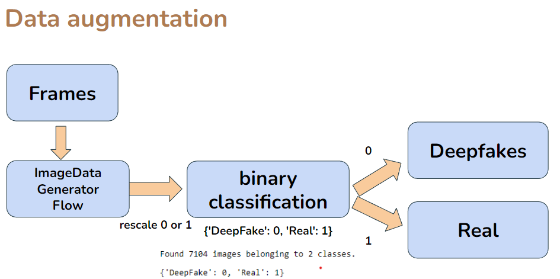
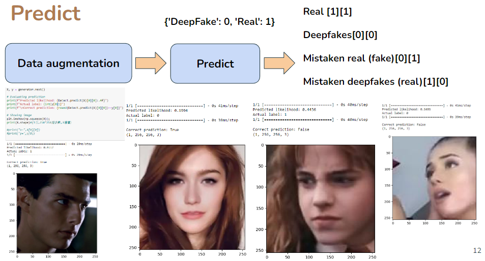
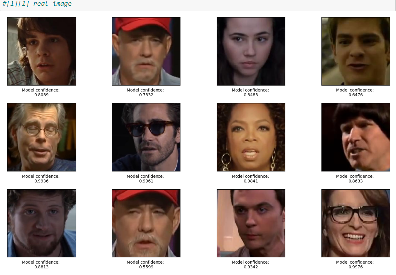
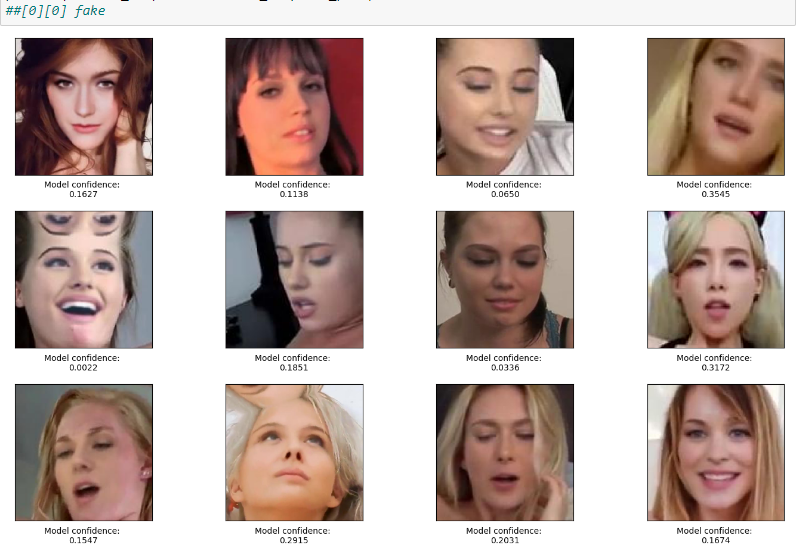
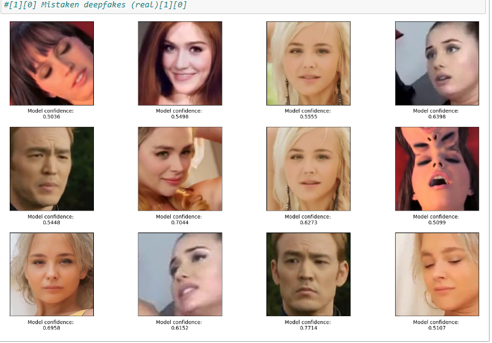
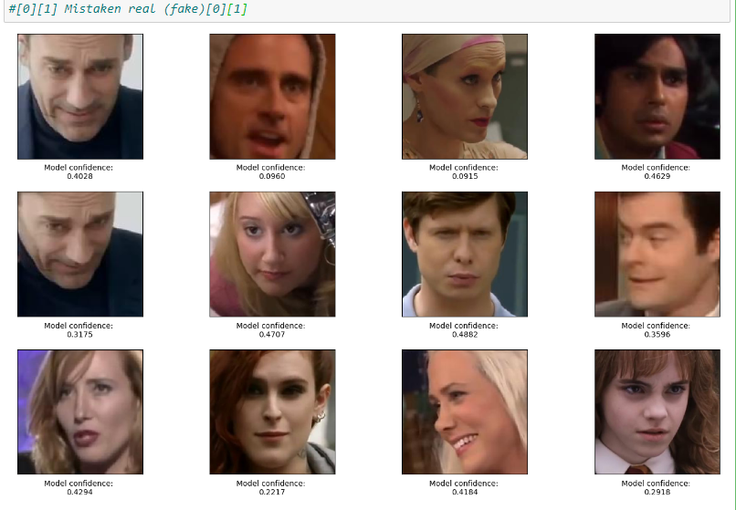

# Exploring Deepfake Detection with DetectNet

"Deepfakes" refer to fake media, like pictures and videos, that are developed using deep neural networks. Unlike fake media created using Photoshop, these forgeries are _almost indistinguishable_ from the real thing.

In this project, I explore the world of Deepfakes using a pre-trained model engineered to detect them, known as **DetectNet**.

Dataset
==
Small dataset :  
Deepfakes photos : 2,845 frames 
Real  photos : 4,259 frames 
Total : 7,104 

 
 

Data augmentation
==

 
 

Predict
==

 
 

You will see the 4 states
==

Real
--

Deepfakes
--

Mistaken deepfakes (actually the image is real)
--

Mistaken real (actually the image is fake)
--

Result
==
Real : 3748 
Mistaken for fake : 512 (誤認成為假的，其實是真的) 
DeepFake : 2563 
mistaken for real : 281 (誤認成為真的，其實是假的) 
total : 7104 
 
正確率 : 0.88 
錯誤率 : 0.12 
