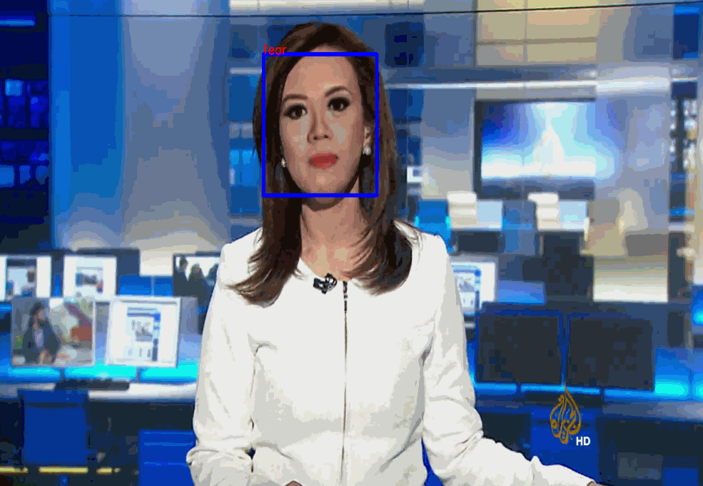
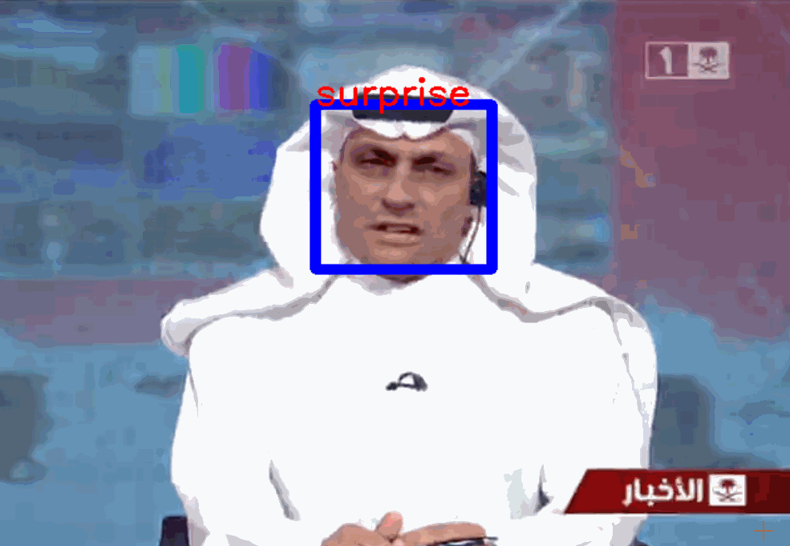

# The Emotion Detection and Video Frames Counter
<br>
<br>

## I create the "Emotion Detection" and "Video Frames Counter" to detect and counter the video from "FaceForensics++" dataset
<br>

## Env document
I provided the environment yaml file for conda<br>
<br>
You can import the environment with the following command<br>
```
conda env create -n env_name -f emotion_counter.yaml
```
Execute the following python command to start execution<br>
```
python video_Emotion_detection.py
```
<br>


## Result of Emotion Detection
The Emotion of the Video from dataset.

